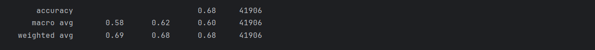
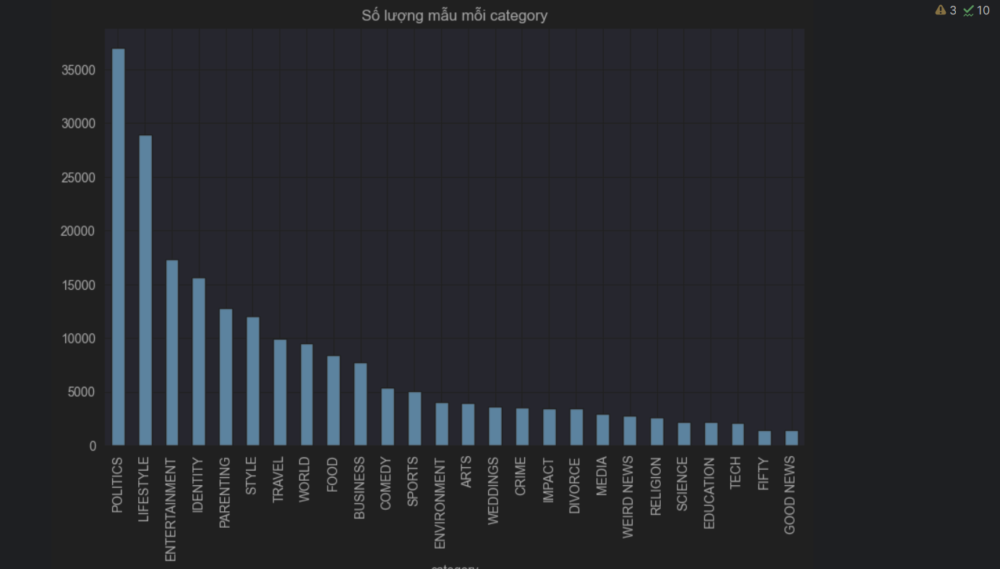
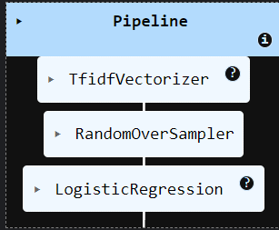
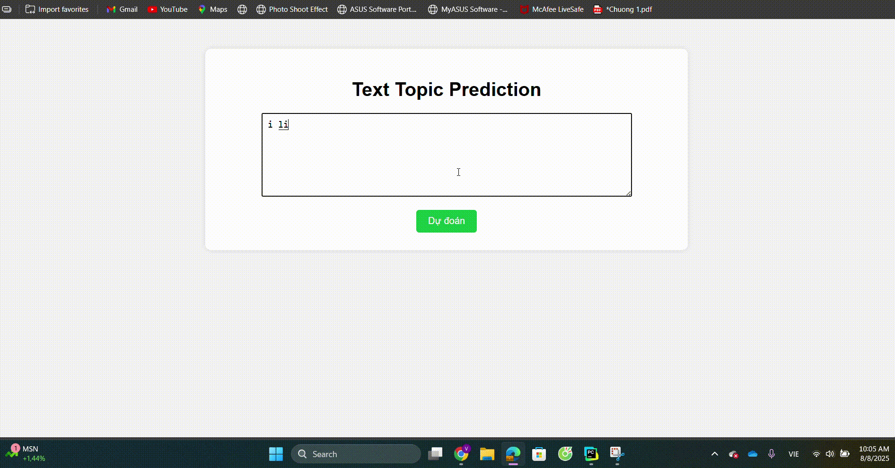

<h1>📰 Text Topic Classifier</h1>

## 📌 Giới thiệu  
Dự án **Text Topic Classifier** là một mô hình Machine Learning có khả năng phân loại văn bản tiếng Anh vào nhiều chủ đề khác nhau, dựa trên kỹ thuật **TF-IDF + Logistic Regression** kết hợp **RandomOverSampler** để xử lý mất cân bằng dữ liệu.  

Ứng dụng đi kèm **Flask Web App** giúp người dùng nhập văn bản trực tiếp và nhận dự đoán ngay lập tức.  

***Đây là mô hình nhỏ mang tính chất học tập.***  

---
## 🤖 Lý do chọn mô hình Logistic Regression
1. **Hiệu quả với TF-IDF:** Logistic Regression hoạt động tốt với dữ liệu vector hóa cao chiều (high-dimensional sparse vectors) từ TF-IDF.
2. **Tốc độ huấn luyện nhanh:** Huấn luyện nhanh hơn nhiều mô hình phức tạp như Random Forest hay XGBoost.
3. **Hỗ trợ phân loại đa lớp:** Tham số `multi_class='multinomial'` giúp dự đoán nhiều chủ đề cùng lúc.
4. **Dễ diễn giải:** Có thể phân tích trọng số để hiểu rõ các từ/ngữ ảnh hưởng mạnh nhất.
5. **Ổn định với dữ liệu mất cân bằng:** Khi kết hợp RandomOverSampler, mô hình vẫn giữ độ chính xác tốt mà không quá khớp.
6. **Ít tốn tài nguyên:** Dễ triển khai trên Flask, không yêu cầu GPU mạnh.

## 🚀 Tính năng  
- Huấn luyện mô hình phân loại đa lớp với hơn 20 chủ đề khác nhau.  
- Xử lý mất cân bằng dữ liệu bằng **RandomOverSampler**.  
- Giao diện web đơn giản, nhập văn bản → dự đoán chủ đề ngay.  
- Lưu & tải mô hình nhanh chóng với `joblib`.  
- Hỗ trợ dự đoán bất kỳ đoạn văn bản mới *(hạn chế: chỉ hỗ trợ tiếng Anh)*.  

---

## 📊 Kết quả mô hình  
**Độ chính xác trên tập test:**  

  

---

## 📈 Phân bố dữ liệu  
Biểu đồ dưới đây cho thấy sự mất cân bằng dữ liệu giữa các chủ đề:  

  

---

## 🛠 Pipeline xử lý  
Quy trình huấn luyện:  

  

---

## 🖥 Demo giao diện web  

---

## 🎥 Video demo  
<p align="center">
  <br/>
  <i>An example of app demo for my model's output for News_Category dataset.</i>
</p>

---

## 📦 Cài đặt  
```bash
git clone https://github.com/<your-username>/text-topic-classifier.git
cd text-topic-classifier
pip install -r requirements.txt
```

---

## ⚡ Huấn luyện mô hình  
```bash
python src/train_model.py
```
Sau khi huấn luyện, mô hình (`model.pkl`) sẽ được lưu trong thư mục `outputs/`.

---

## 🌐 Chạy web app  
```bash
python app/app.py
```
Sau đó mở trình duyệt và truy cập:  
```
http://127.0.0.1:5000
```

---

## 📂 Cấu trúc thư mục  
```
text-topic-classifier/
│
├── app/                 # Flask web app
├── demo/                # Ảnh & video minh họa
├── outputs/             # Mô hình đã huấn luyện
├── src/                 # Code xử lý & huấn luyện
│   ├── preprocess.py
│   ├── train_model.py
│
├── requirements.txt
└── README.md
```
